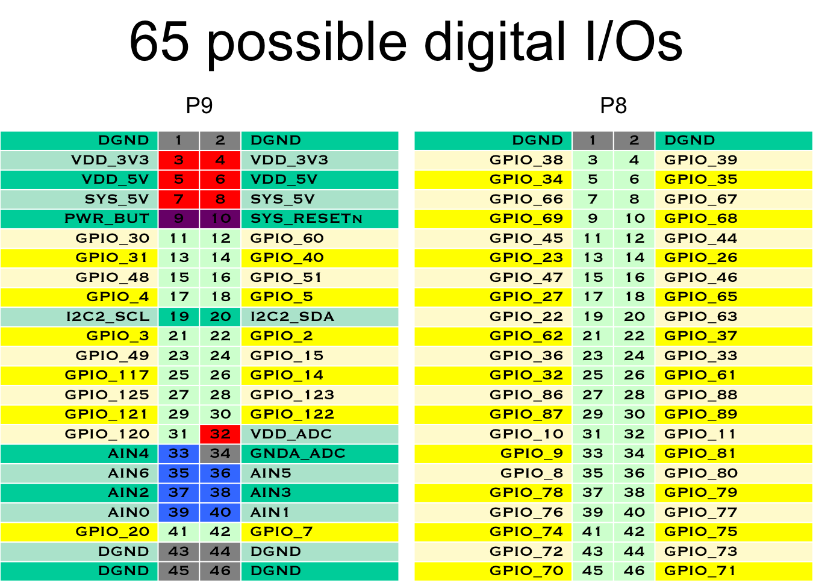

### Project Details and Overview

For this project we will be using a laptop, running Windows.    

On the windows operrating system we will have a Linux operating system running on a virtual machince to comunicate with the beaglebone device.  

To accomplish this, we have installed a VMWare system and are employing a Virtual Machine. Within the Virtual Machine we are using Ubuntu, a Linux OS.    

Since our The Beagle Bone Black (BBB) runs a Linux system with different binary than the Windows laptop , we will use a cross-complier from a needed libarary.  

In detail, we are running the Eclipse IDE to write C++ code and compile it on the (BBB) and  because of the need for a Cross Compiler capability in Eclipse.  

The way we are doing the data communication must be wireless from the laptop to the Beagle Bone Black because the
3 axis Gyro needs to be able to move around independent of physical wiring to avoid tangles.  

In short, data will travel between a laptop and a BBB, wirelessly as TCP/IP. The data will travel from a Windows OS to a Virtual Machine
with a Linux OS and through a cross complier where it will output as a physical movement of motors inwhich will also be recorded and saved. 

So mainly, the users task will endeavor an “input” to the laptop through the uploading of the .txt file with pre-meditated inputs or the Graphic user interface in which we must design. 

### Instructions and Set UP

GPIO 51- RED -  PURPLE WIRE     pin 16 (p9)

GPIO 60 - GREEN - YELLOW WIRE   pin 12  (p9)

GPIO 30 - BLUE - WHITE WIRE     pin 11   (p9)

g++ -Wno-write-strings serv.cpp -o servLights

ssh 192.168.7.2 -l root

http://derekmolloy.ie/gpios-on-the-beaglebone-black-using-device-tree-overlays/

